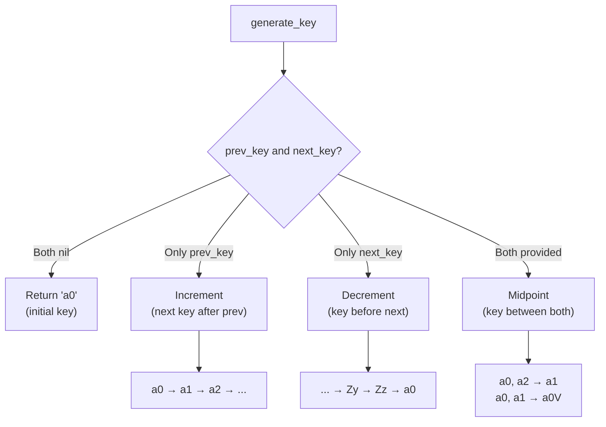

# Fractional Indexer

[](https://codecov.io/gh/kazu-2020/fractional_indexer)
[](https://github.com/kazu-2020/fractional_indexer/actions/workflows/ruby.yml)

> Efficient data insertion and sorting through fractional indexing

## Overview

Fractional Indexer is a Ruby gem that implements **fractional indexing** for managing ordered sequences. Instead of using integer positions that require reindexing on insertion, it uses string-based keys that allow inserting items anywhere without affecting existing items.

### Why Fractional Indexing?

**Traditional integer indexing** requires shifting all subsequent items when inserting:

```
Before:    [A:1] [B:2] [C:3]
                  ↓
Insert X between A and B
                  ↓
After:     [A:1] [X:2] [B:3] [C:4]  ← B and C must be updated!
```

**Fractional indexing** generates a key between existing keys without reindexing:

```
Before:    [A:"a0"] [B:"a1"] [C:"a2"]
                      ↓
Insert X between A and B
                      ↓
After:     [A:"a0"] [X:"a0V"] [B:"a1"] [C:"a2"]  ← No changes to B or C!
```

### Key Features

- **No reindexing required** - Insert items between any two existing items
- **String-based keys** - Avoids floating-point precision issues
- **Configurable base** - Supports base-10, base-62 (default), and base-94
- **Multiple key generation** - Generate multiple keys at once for batch operations

This gem implements the concepts from "[Realtime editing of ordered sequences](https://www.figma.com/blog/realtime-editing-of-ordered-sequences/#fractional-indexing)" (Figma Engineering Blog).

> [!TIP]
> **Using Rails?** Check out [narabikae](https://github.com/kazu-2020/narabikae) - an Active Record integration that makes fractional indexing as simple as `task.move_to_position_after(other_task)`

## Installation

Add this line to your application's Gemfile:

```ruby
gem 'fractional_indexer'
```

And then execute:

```sh
bundle
```

Or install it yourself as:

```sh
gem install fractional_indexer
```

## Quick Start

```ruby
require 'fractional_indexer'

# Step 1: Generate your first key
first_key = FractionalIndexer.generate_key
# => "a0"

# Step 2: Generate the next key (for appending)
second_key = FractionalIndexer.generate_key(prev_key: first_key)
# => "a1"

# Step 3: Insert between two keys
middle_key = FractionalIndexer.generate_key(prev_key: first_key, next_key: second_key)
# => "a0V"

# Result: first_key < middle_key < second_key
# "a0" < "a0V" < "a1"
```

## How It Works

### Order Key Structure

An order key consists of two parts: an **integer part** and an optional **fractional part**.

```
"a3012"
 │└┬┘└┬┘
 │ │  └── Fractional Part: "012" (optional, for fine-grained positioning)
 │ └───── Integer Digits: "3" (the numeric value)
 └─────── Prefix: "a" (indicates 1-digit positive integer)
```

**Prefix rules:**
- `a` to `z`: Positive integers (a=1 digit, b=2 digits, ..., z=26 digits)
- `A` to `Z`: Negative integers (used for keys "before" zero)

**Examples:**

| Key | Integer Part | Fractional Part | Meaning |
|-----|-------------|-----------------|---------|
| `a5` | `a5` | (none) | Positive 1-digit: 5 |
| `b12` | `b12` | (none) | Positive 2-digit: 12 |
| `a3V` | `a3` | `V` | Between a3 and a4 |
| `Zz` | `Zz` | (none) | Largest negative number |

### Key Generation Flow

The following diagram shows how `generate_key` determines which operation to perform:



## Usage

### Basic Usage

#### Generating a Single Key

```ruby
require 'fractional_indexer'

# Create the first order key (when no keys exist)
FractionalIndexer.generate_key
# => "a0"

# Increment: generate key after a given key
FractionalIndexer.generate_key(prev_key: 'a0')
# => "a1"

# Decrement: generate key before a given key
FractionalIndexer.generate_key(next_key: 'a0')
# => "Zz"

# Between: generate key between two keys
FractionalIndexer.generate_key(prev_key: 'a0', next_key: 'a2')
# => "a1"
```

#### Generating Multiple Keys

```ruby
# Generate 5 keys after "b11"
FractionalIndexer.generate_keys(prev_key: "b11", count: 5)
# => ["b12", "b13", "b14", "b15", "b16"]

# Generate 5 keys before "b11"
FractionalIndexer.generate_keys(next_key: "b11", count: 5)
# => ["b0w", "b0x", "b0y", "b0z", "b10"]

# Generate 5 keys between "b10" and "b11"
FractionalIndexer.generate_keys(prev_key: "b10", next_key: "b11", count: 5)
# => ["b108", "b10G", "b10V", "b10d", "b10l"]
```

#### Error Handling

```ruby
# prev_key must be less than next_key
FractionalIndexer.generate_key(prev_key: 'a2', next_key: 'a1')
# => raises error

# prev_key and next_key cannot be equal
FractionalIndexer.generate_key(prev_key: 'a1', next_key: 'a1')
# => raises error
```

### Practical Examples

#### Example 1: Task List Management

```ruby
# Managing a todo list with fractional indexing
tasks = []

# Add initial tasks
tasks << { id: 1, title: "Write code",    position: FractionalIndexer.generate_key }
tasks << { id: 2, title: "Write tests",   position: FractionalIndexer.generate_key(prev_key: tasks.last[:position]) }
tasks << { id: 3, title: "Deploy",        position: FractionalIndexer.generate_key(prev_key: tasks.last[:position]) }

tasks.each { |t| puts "#{t[:position]}: #{t[:title]}" }
# a0: Write code
# a1: Write tests
# a2: Deploy

# Insert "Code review" between "Write tests" and "Deploy"
new_position = FractionalIndexer.generate_key(
  prev_key: tasks[1][:position],  # "a1"
  next_key: tasks[2][:position]   # "a2"
)
tasks << { id: 4, title: "Code review", position: new_position }

# Sort by position
tasks.sort_by! { |t| t[:position] }
tasks.each { |t| puts "#{t[:position]}: #{t[:title]}" }
# a0: Write code
# a1: Write tests
# a1V: Code review   ← Inserted without changing other positions!
# a2: Deploy
```

#### Example 2: Prepending and Appending

```ruby
# Start with a middle item
items = [{ name: "B", pos: FractionalIndexer.generate_key }]
# items[0][:pos] => "a0"

# Append to the end (only prev_key)
items << { name: "C", pos: FractionalIndexer.generate_key(prev_key: items.last[:pos]) }
# items[1][:pos] => "a1"

# Prepend to the beginning (only next_key)
items.unshift({ name: "A", pos: FractionalIndexer.generate_key(next_key: items.first[:pos]) })
# items[0][:pos] => "Zz"

items.sort_by { |i| i[:pos] }.each { |i| puts "#{i[:pos]}: #{i[:name]}" }
# Zz: A
# a0: B
# a1: C
```

#### Example 3: Batch Insertion

```ruby
# Insert 5 items between two existing items at once
existing = [
  { name: "First",  pos: "a0" },
  { name: "Last",   pos: "a1" }
]

# Generate 5 keys between "a0" and "a1"
new_positions = FractionalIndexer.generate_keys(
  prev_key: existing[0][:pos],
  next_key: existing[1][:pos],
  count: 5
)
# => ["a08", "a0G", "a0V", "a0d", "a0l"]

new_items = new_positions.map.with_index do |pos, i|
  { name: "Item #{i + 1}", pos: pos }
end

all_items = (existing + new_items).sort_by { |i| i[:pos] }
all_items.each { |i| puts "#{i[:pos]}: #{i[:name]}" }
# a0: First
# a08: Item 1
# a0G: Item 2
# a0V: Item 3
# a0d: Item 4
# a0l: Item 5
# a1: Last
```

#### Example 4: Key Growth Over Time

When repeatedly inserting at the same position, keys grow longer to maintain precision:

```ruby
# Repeatedly insert at the beginning
key = FractionalIndexer.generate_key  # => "a0"
puts "Initial: #{key}"

5.times do |i|
  key = FractionalIndexer.generate_key(prev_key: key, next_key: "a1")
  puts "Insert #{i + 1}: #{key}"
end

# Initial: a0
# Insert 1: a0V
# Insert 2: a0l
# Insert 3: a0t
# Insert 4: a0x
# Insert 5: a0z
```

## Configuration

### Base System

You can configure the base (number system) used to represent each digit. The possible values are `:base_10`, `:base_62` (default), and `:base_94`.

| Base | Characters | Use Case |
|------|-----------|----------|
| `:base_10` | `0-9` | Debugging, human-readable |
| `:base_62` | `0-9`, `A-Z`, `a-z` | General use (default) |
| `:base_94` | All printable ASCII | Maximum density |

```ruby
require 'fractional_indexer'

# Base 10 (for debugging)
FractionalIndexer.configure do |config|
  config.base = :base_10
end
FractionalIndexer.configuration.digits.join
# => "0123456789"

# Base 62 (default)
FractionalIndexer.configure do |config|
  config.base = :base_62
end
FractionalIndexer.configuration.digits.join
# => "0123456789ABCDEFGHIJKLMNOPQRSTUVWXYZabcdefghijklmnopqrstuvwxyz"

# Base 94 (maximum density)
FractionalIndexer.configure do |config|
  config.base = :base_94
end
FractionalIndexer.configuration.digits.join
# => "!\"#$%&'()*+,-./0123456789:;<=>?@ABCDEFGHIJKLMNOPQRSTUVWXYZ[\\]^_`abcdefghijklmnopqrstuvwxyz{|}~"
```

## Related Projects

### narabikae

If you're using **Ruby on Rails** with **Active Record**, check out [narabikae](https://github.com/kazu-2020/narabikae) - a gem that integrates Fractional Indexer directly into your models for seamless ordering.

```ruby
class Task < ApplicationRecord
  narabikae :position, size: 200
end

# Move a task after another
task.move_to_position_after(other_task)

# Move a task before another
task.move_to_position_before(other_task)

# Move a task between two others
task.move_to_position_between(task_a, task_b)
```

## Contributing

Bug reports and pull requests are welcome on GitHub at <https://github.com/kazu-2020/fractional_indexer>.

## License

The gem is available as open source under the terms of the [MIT License](https://opensource.org/licenses/MIT).

## Acknowledgments

This gem was implemented based on the excellent article "[Implementing Fractional Indexing](https://observablehq.com/@dgreensp/implementing-fractional-indexing)" by David Greenspan. Thank you for the clear explanation and reference implementation!
